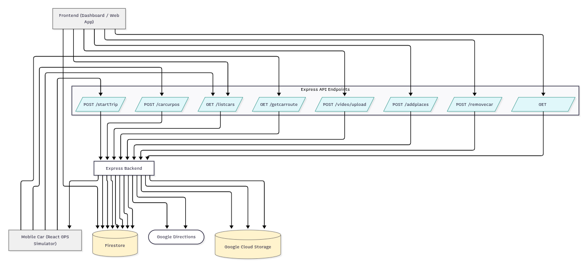

# 🚗 Mobile Ads Platform – Backend (Express + Firebase + GCS)

This repository provides the backend API for the Mobile Ads Platform, where simulated cars drive around mapped routes while displaying videos as in-car advertisements. The backend manages cars, places, trips, and videos, using Express.js, Firebase Firestore, and Google Cloud Storage (GCS).

## 🧩 Tech Stack
Component	Technology
Backend Framework	Express.js (Node.js)
Database	Firebase Firestore
Storage	Google Cloud Storage
External API	Google Directions API
Authentication	Service Account (Application Default Credential)
Video Handling	GCS streaming with HTTP Range requests
Routing	Polyline decoding via @mapbox/polyline

## ⚙️ Environment Variables

Create a .env file at the project root:

PORT=3000
DIRECTION_API=<your_google_directions_api_key>
GCS_BUCKET_NAME=<your_google_cloud_storage_bucket>
GOOGLE_APPLICATION_CREDENTIALS=/path/to/service-account.json

# 🧠 Core Concepts

## 1. Car Management

Each car is represented as a Firestore collection (car1, car2, etc.) containing:

places → list of location names (for routes)

video → metadata for uploaded video files

Example Firestore structure:

car1/
  ├── places
  └── video
cars_latest_position/
  ├── car1_<timestamp>
  │    ├── positions/
  │    └── (lat, lng, timestamp)

## 🚀 API Endpoints
###  GET /listcars

Retrieves all cars and their associated places and video metadata.

Response:
```bash
[
  {
    "id": "car1",
    "places": ["Jakarta", "Bandung"],
    "video": "adfile.mp4"
  }
]
```

### POST /addplaces

Adds or updates the list of places for a car.

Body:
```bash
{
  "carId": "car1",
  "places": ["Jakarta", "Bandung", "Surabaya"]
}
```

Response:
```bash
{ "success": true, "carId": "car1" }
```

### POST /removecar

Deletes a car and all associated Firestore documents and videos from GCS.

Body:
```bash
{ "carId": "car1" }
```

Response:
```bash
{ "success": true, "removed": "car1" }
```

### GET /getcarroute?carId=car1

Generates a looped driving route between all places of a car using Google Directions API.

Response:
```bash
[
  { "lat": -6.2, "lng": 106.8 },
  { "lat": -6.3, "lng": 107.0 },
  ...
]
```

### POST /carcurpos

Logs current position of a car and stores it in Firestore (used for real-time map updates).

Body:
```bash
{
  "carId": "car1",
  "lat": -6.200,
  "lng": 106.816,
  "newTrip": false
}
```

Response:
```bash
{ "success": true, "carId": "car1", "document": "car1_20250111T..." }
```

### POST /startTrip

Generates a timeline of expected routes (legs) with ETA based on Google Directions API and stores them in a dedicated Firestore collection.

Body:
```bash
{
  "carId": "car1",
  "startTime": "2025-11-11T10:00:00Z"
}
```

Response:
```bash
{
  "success": true,
  "totalLegs": 12,
  "collection": "car1_coll_20251111T100000"
}
```

### /video Routes

Handled by a separate file (routes/video.js), includes upload functionality using FormData.

POST /video/upload → Upload a new car video.

GET /stream/:filename → Stream video with range support.

GET /stream/:filename

Streams video directly from GCS with support for partial content (byte ranges) for smooth playback.

Example:
GET /stream/ad_car1.mp4

Response:
Binary video stream (Content-Type: video/mp4).

## 🧩 Key Internal Functions

| Function | Purpose |
|-----------|----------|
| `getRoutePoints(origin, destination)` | Uses **Google Directions API** to generate and decode coordinate paths. |
| `getDocumentName(carId, forceNew)` | Creates a **unique Firestore document ID** per car trip, optionally forcing a new one. |
| `logPositionToFirestore()` | Logs **car positions with timestamps**, maintaining a subcollection of route points. |
| `getDirectionsForPlaces()` | Computes **multi-leg travel data** (distance and duration) between listed locations. |
| `getBucket()` | Returns a reference to the configured **Google Cloud Storage bucket** for video or data handling. |




